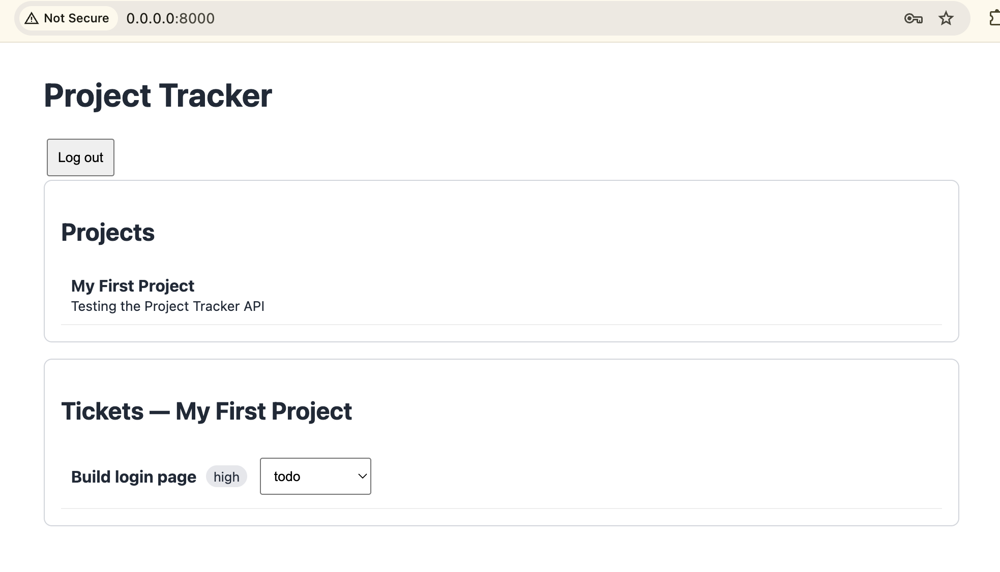

# Project Tracker API

A compact, portfolio-ready backend for projects and tickets: FastAPI, async SQLAlchemy 2.0, PostgreSQL, Alembic, JWT authentication, and a lightweight browser demo.

## Architecture

```text
Browser demo / API client
          |
     FastAPI routers  (/api/v1)
          |
        services      (business rules, history records)
          |
      repositories    (database queries)
          |
 SQLAlchemy async ORM -> PostgreSQL
          ^
       Pydantic schemas (validation and responses)
```

Every protected endpoint validates a Bearer JWT through FastAPI dependencies. Project edits/deletion are owner-only. Ticket status, priority, and assignee changes create `TicketHistory` rows automatically.

## Demo


## Project layout

```text
app/        API, schemas, services, repositories, models, static demo
alembic/    database migration environment and initial migration
tests/      async integration tests using isolated SQLite
```

## Local setup

Requires Python 3.11+ and a running PostgreSQL database.

```bash
cp .env.example .env
# Edit DATABASE_URL in .env if your local Postgres credentials differ.
python -m venv .venv
source .venv/bin/activate
pip install -r requirements.txt
alembic upgrade head
uvicorn app.main:app --reload
```

Open the API docs at http://localhost:8000/docs and the demo UI at http://localhost:8000/.

## Docker

```bash
cp .env.example .env
docker-compose up --build
```

This starts the API at http://localhost:8000 and PostgreSQL together. The API startup command applies `alembic upgrade head`; both services have healthchecks.

## Migrations

```bash
alembic upgrade head
# After model changes:
alembic revision --autogenerate -m "describe change"
alembic upgrade head
```

## Tests

```bash
pytest
```

Tests use `sqlite+aiosqlite` in a local `test_project_tracker.db`, recreate the schema per test, and cover auth, project CRUD/permissions, ticket CRUD/filtering, and automatic ticket history.

## Example API flow

Register and capture a token:

```bash
curl -X POST http://localhost:8000/api/v1/auth/register \
  -H 'Content-Type: application/json' \
  -d '{"email":"sam@example.com","password":"password123","full_name":"Sam Example"}'

curl -X POST http://localhost:8000/api/v1/auth/login \
  -H 'Content-Type: application/json' \
  -d '{"email":"sam@example.com","password":"password123"}'
```

Create a project and ticket (replace `$TOKEN` and `$PROJECT_ID`):

```bash
curl -X POST http://localhost:8000/api/v1/projects \
  -H "Authorization: Bearer $TOKEN" -H 'Content-Type: application/json' \
  -d '{"name":"Website refresh","description":"Q3 work"}'

curl -X POST http://localhost:8000/api/v1/projects/$PROJECT_ID/tickets \
  -H "Authorization: Bearer $TOKEN" -H 'Content-Type: application/json' \
  -d '{"title":"Implement login","priority":"high"}'

curl -X PATCH http://localhost:8000/api/v1/tickets/1 \
  -H "Authorization: Bearer $TOKEN" -H 'Content-Type: application/json' \
  -d '{"status":"in_progress"}'
```
